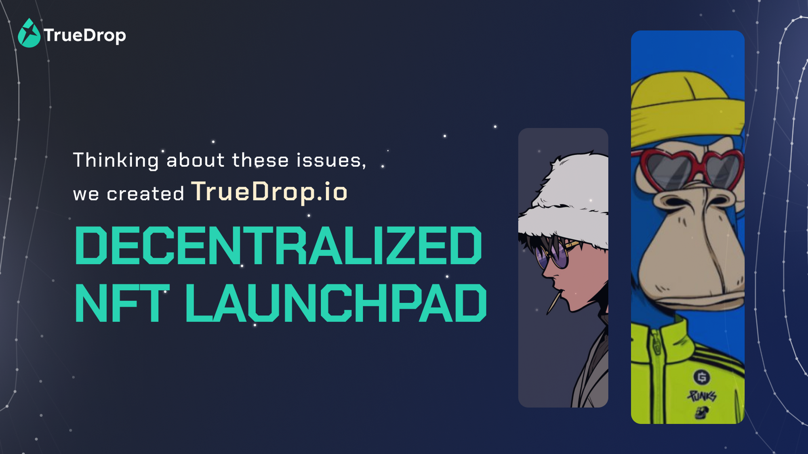
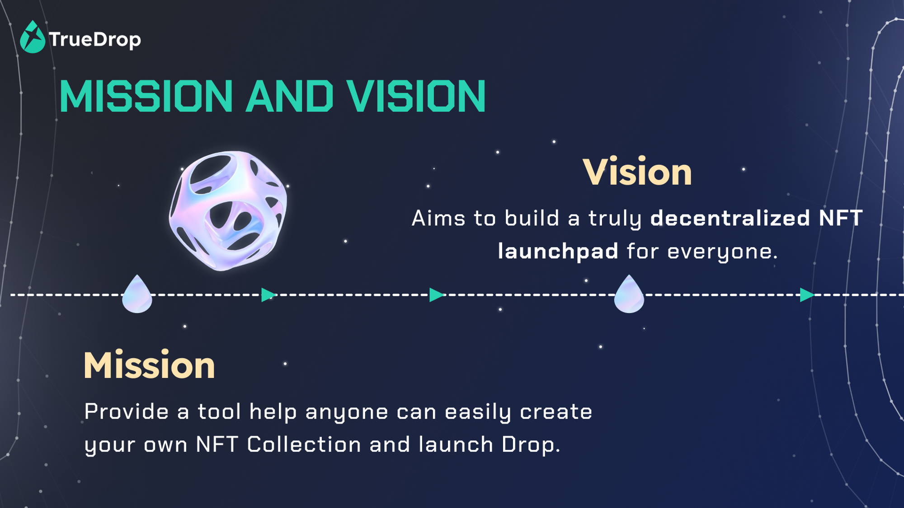
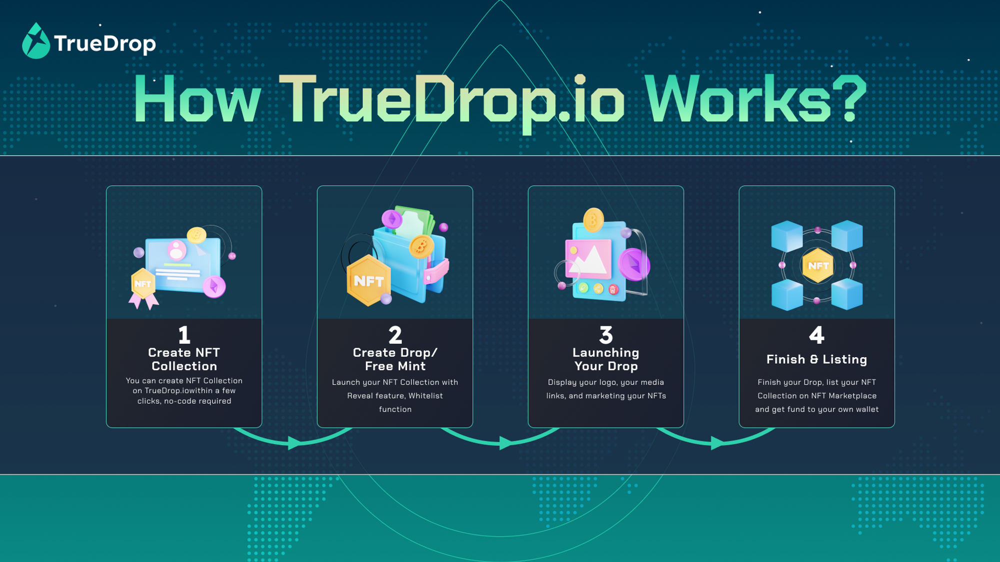
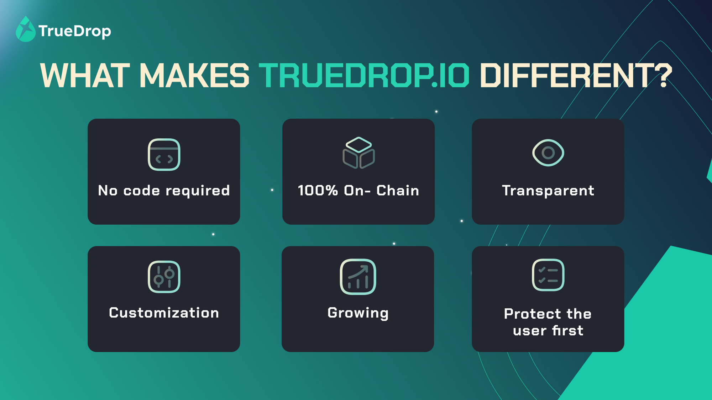
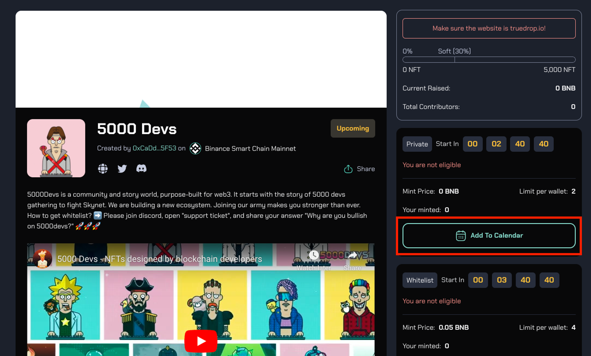

# TrueDrop.io

## Introduction

#### What is TrueDrop.io

According to a report from [nonfungible.com](http://nonfungible.com/), NFT sales jumped to more than $17 billion last year, a sharp 21,000% increase from 2020’s total of $82 million.

Today, there are several amazing creators and their NFT collections. However, launching one’s NFT collection is no easy task. To begin, you must understand how NFTs work, smart contracts, and other NFT lingo. Next, how do you get your NFT collection launched and get funding? All of these are obstacles for potential creators and their collections.

TrueDrop is a decentralized NFT launchpad that helps everyone can create an NFT Drop in a few seconds. Simply put, users from anywhere can create and launch their NFT collection on TrueDrop with zero smart contract development skills and a complicated censorship process!

#### What's our Mission?

By creating a Decentralized NFT Launchpad, TrueDrop’s mission is to bring NFT to everyone. 

→ Whoever you are, you can easily create your own NFT Collection and launch NFT Drop.

#### ****Social Links****

- Website: [http://truedrop.io/](http://truedrop.io/)
- Twitter: [https://twitter.com/TruedropNFT](https://twitter.com/TruedropNFT)
- Discord: [https://discord.gg/xept99fFZg](https://discord.gg/xept99fFZg)
- Medium: [https://truedrop.medium.com/](https://truedrop.medium.com/)
- Telegram: [https://t.me/Bob_Truedrop](https://t.me/Bob_Truedrop)
- Galxe: [https://galxe.com/TrueDrop](https://galxe.com/TrueDrop)
- Quest3: [https://app.quest3.xyz/TrueDrop](https://app.quest3.xyz/TrueDrop)
- Crew3: [https://truedrop.crew3.xyz/](https://truedrop.crew3.xyz/)

## How TrueDrop.io Works?

TrueDrop.io is a protocol that is fully on-chain & decentralized. All our features run automatically on smart contracts and are audited by a top security company. You can create a drop event for your NFT project without code in a few seconds. Simple as eating a cake!

At TrueDrop, we’re excited to announce our use of the ERC-721A NFT smart contract for our decentralized NFT launchpad platform. The ERC-721A standard is an extension of the popular ERC-721 standard, with additional features that allow for more flexibility and control over NFT contracts.

ERC721A is a gas-efficient implementation of the common ERC721 standard used by notable projects to mint multiple NFTs in batches. ERC721A supports minting multiple tokens for close to the cost of one. With the ERC721A standard being used, everyone can definitely mint NFT on [TrueDrop.io](http://truedrop.io/) at an extremely cheap cost even in large quantities.

## Why TrueDrop?

Unlike other existing NFT launchpads, TrueDrop focuses on simplifying creators’ NFT collection creation and drops. Because of this, our platform has a wide advantage that you can trust to implement into your collection.

- **No coding required**: Create your NFT collection & drop event without code in a few seconds. Simple as eating a cake.
- **100% On-Chain**: TrueDrop.io is a protocol that is fully on-chain and decentralized. All our features run automatically on smart contracts and are audited by top security companies.
- **Transparent:** The ****NFT Drop mechanism and NFTs’ project information are transparent and cannot be changed. Total supply, mint fee, royalty, listing location, NFT vesting, etc., are transparent and checkable.
- **Customization**: Create your NFT collection and drop events easily. You can also completely customize your NFT Drop.
- **Growing**: Build your community with strong tools from TrueDrop. Promote your NFT Collection to thousands of collectors on us.
- **Testnet Experience**: TrueDrop.io makes it easy to create and deploy your NFT collection on testnet.

> With no-code required, ANYONE can use our feature to begin their journey with NFT as a creator or collector 👇

### For Creators

**Welcome 👋**

Head to [truedrop.io](http://truedrop.io) 

Connect your wallet using the `Connect wallet` button.

> 🖼️ ****To create an NFT collection:**** [https://docs.truedrop.io/collection/create-an-nft-collection](https://docs.truedrop.io/collection/create-an-nft-collection)

>💧 **Create Drop:** [https://docs.truedrop.io/drop-event/create-drop](https://docs.truedrop.io/drop-event/create-drop)   
>&nbsp;&nbsp;&nbsp;&nbsp;&nbsp;&nbsp;**Create Free Mint:** [https://docs.truedrop.io/drop-event/create-free-mint](https://docs.truedrop.io/drop-event/create-free-mint)   
>&nbsp;&nbsp;&nbsp;&nbsp;&nbsp;&nbsp;**Finalize a Drop:** [https://docs.truedrop.io/drop-event/finalize-a-drop](https://docs.truedrop.io/drop-event/finalize-a-drop)

> *If you need support or marketing service on TrueDrop.io, please contact our support team on Telegram: [https://t.me/Bob_Truedrop](https://t.me/Bob_Truedrop)*
>

### For Collectors

**Welcome 👋**

Head to [truedrop.io](http://truedrop.io) 

Connect your wallet using the `Connect wallet` button.

>🖼️ **To mint an NFT:** [https://docs.truedrop.io/investing/how-to-buy-an-nft-on-truedrop.io](https://docs.truedrop.io/investing/how-to-buy-an-nft-on-truedrop.io)   
>&nbsp;&nbsp;&nbsp;&nbsp;&nbsp;&nbsp;**To claim NFT**: [https://docs.truedrop.io/investing/how-to-claim-nft](https://docs.truedrop.io/investing/how-to-claim-nft)

> 💧 ****Emergency Withdraw:**** [https://docs.truedrop.io/investing/emergency-withdraw](https://docs.truedrop.io/investing/emergency-withdraw)

> 🗓️ Add NFT Drop into your Calendar: **View Drop → Add to Calendar → Save on Google Calendar**
>

## Testnet Experience

### Why you should try Testnet on TrueDrop?

If you are not ready to launch your own NFT collection for a variety of reasons, consider creating them using Testnet on [truedrop.io](http://truedrop.io/). 

- **Testing**: By launching on a testnet, creators can test the functionality of their NFTs and ensure that everything works as expected. This can help identify and fix any bugs or errors before the NFT is launched on the mainnet.
- **Cost-effective**: Testnet typically do not require real cryptocurrency to be used, you can get free Testnet Token
- **Experimentation**: Testnet provides a safe environment for experimenting with new ideas and features that might not be possible or cost-effective on the mainnet.
- **Community feedback**: Testnet allows creators to get feedback from the community and make adjustments before the final launch on the mainnet.

TrueDrop.io makes it easy to create and deploy your NFT collection on testnet.

Head to: [https://testnet.truedrop.io/](https://testnet.truedrop.io/)

## Canto Testnet

> ℹ️ *Canto is migrating to a new testnet network with chain ID 7701 (previously 740). Information about the new testnet is provided below.*
>

Canto has a testnet network for development and testing purposes. To connect to and explore the testnet, use these details:

>**Network Name:** Canto Testnet  
>**New RPC URL:** `https://canto-testnet.plexnode.wtf`  
>**Chain ID:** 7701  
>**Currency Symbol:** CANTO  
>**Block Explorer URL:** [https://testnet.tuber.build/](https://testnet.tuber.build/)
>

## Faucet

To get testnet $CANTO, use the faucet in the [Canto Discord](https://discord.gg/canto). The faucet disperses 50 tokens every 24 hours, per unique address/user.

>🚰 **Faucet Instructions**  
>To use the faucet, locate the `#canto-testnet-faucet` channel in the Canto Discord. In this channel, begin typing `/driptestnet` into the chat bar. When you see the command appear above the chat bar, hit enter and paste in your wallet address. Finally, hit enter once more to send the command.